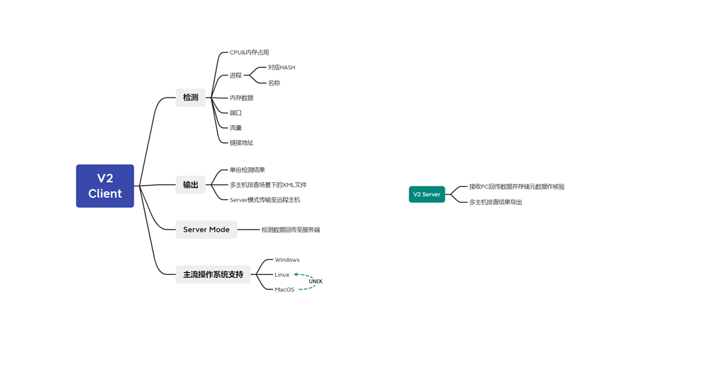
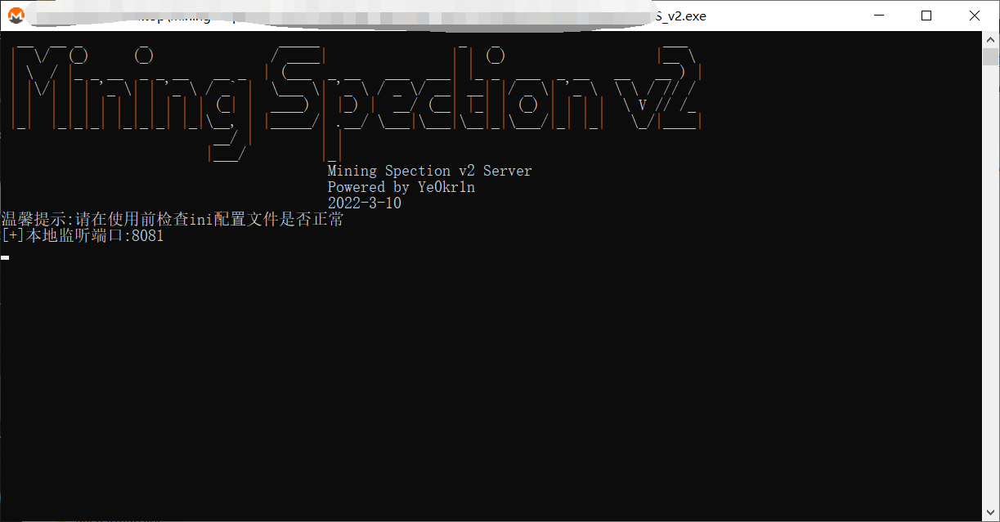
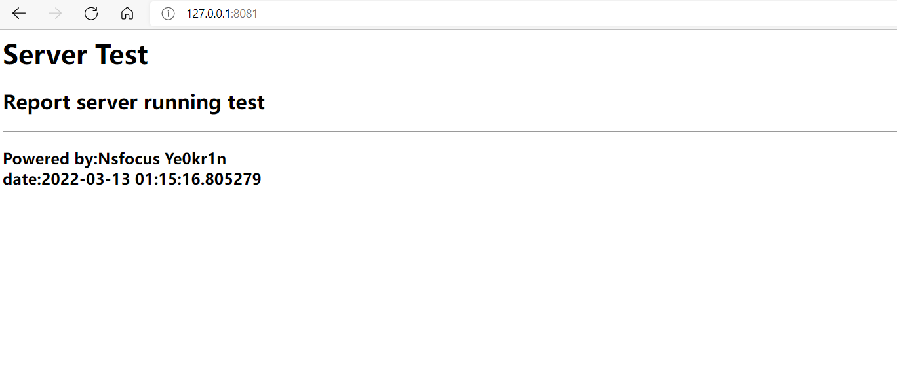
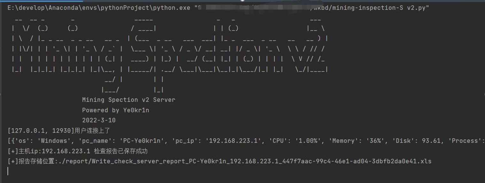
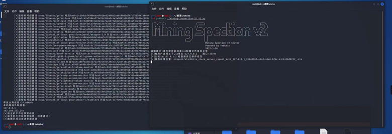
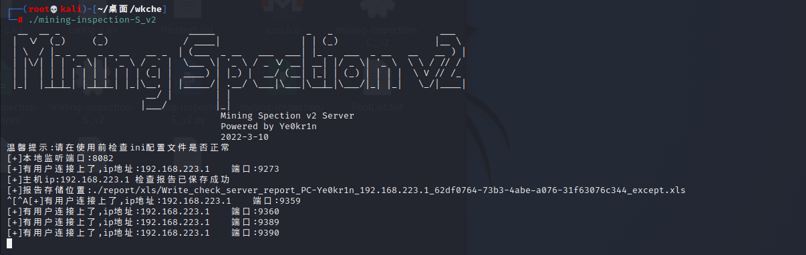
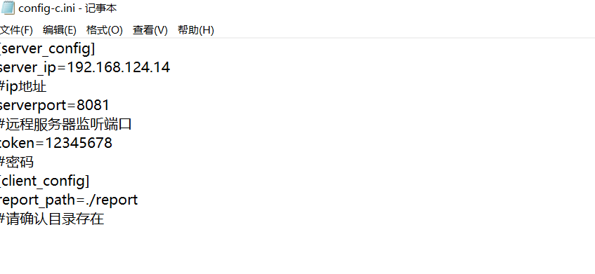
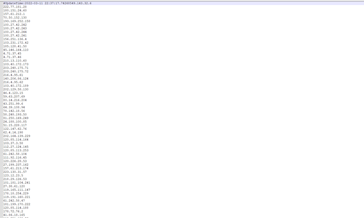
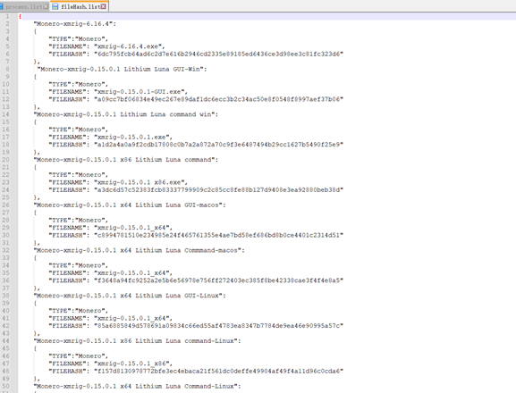
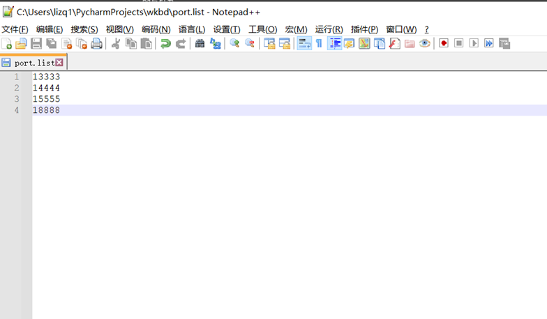

# Mining-inspection Ver2.0

```
  __  __ _       _                _____                 _   _                    ___  
 |  \/  (_)     (_)              / ____|               | | (_)                  |__ \ 
 | \  / |_ _ __  _ _ __   __ _  | (___  _ __   ___  ___| |_ _  ___  _ __   __   __ ) |
 | |\/| | | '_ \| | '_ \ / _` |  \___ \| '_ \ / _ \/ __| __| |/ _ \| '_ \  \ \ / // / 
 | |  | | | | | | | | | | (_| |  ____) | |_) |  __/ (__| |_| | (_) | | | |  \ V // /_ 
 |_|  |_|_|_| |_|_|_| |_|\__, | |_____/| .__/ \___|\___|\__|_|\___/|_| |_|   \_/|____|
                          __/ |        | |                                            
                         |___/         |_|                                            
```

**简介:**该工具主要用于PC机挖矿程序的(注意，是挖矿程序，非挖矿病毒）排查，在主机较多的情况下，实现一键检测，缩短整体交付时间，且在排查者无经验的情况下，可使用该工具减少漏检、误检

## 0x01设计思想



总体功能模块如上图所示，主要用于检测本地异常项，并输出检测报告(xls 或 xml)


## 0X02 检测模式简介


### 2.1 本地模式


本地模式主要用于本地检测完成后在本地生成检测表格，如下图：


(默认保存在report/xls下，具体看config-c.ini的配置信息)

表格文件名保存格式如下：

•check_report_${pc_name}_${ip_addr}_${uuid4}_${flag}.xls

### 2.2服务端模式

需要mining-inspection-S_v2程序配合使用



启动后如上图所示，此时可测试访问查看该地址能否访问通，如下图所示



该模式下主要应用于多主机场景，客户机会将检查结果发送至服务端，服务端进行数据汇总与报告输出，默认输出路径为:./report



具体如上图所示

跨平台支持方面Linux也编译了文件，如下图





Linux的Server端支持任意系统类型 的Client端回传并保存数据

（目前Server端BUG较多，Linux端较为靠谱，不要做渗透测试以及扫描还是可以正常地进行报告汇总的）

### 2.3 离线核查模式

该模式目前处于半完成状态，仅可在检查完后输出XML文件，无法进行XML文件的输入并进行核查，还在想更好的方法去实现中

## 0x03 MISC

### 3.1 config-c.ini

客户端配置文件



详见注释

### 3.2  config-s.ini

服务端配置文件


详见注释

### 3.3 PoolList.list



矿池ip地址列表，可由程序进行更新

### 3.4 Process.list

进程黑名单列表

### 3.5 fileHash.list

文件HASH黑名单列表



### 3.6 port.list

端口黑名单列表



## 0x04 报告导出文件名样式

### 4.1 本地检测导出文件名样式

•check_report_${pc_name}_${ip_addr}_${uuid4}_${flag}.xls


### 4.2 服务端检测导出文件名样式

•write_check_server_report_${pc_name}_{$pc_name}_${uuid4}_${flag}.xls


XML同理

github:https://github.com/Ye0kr1n

Powered by Ye0kr1n

2022-03-13

